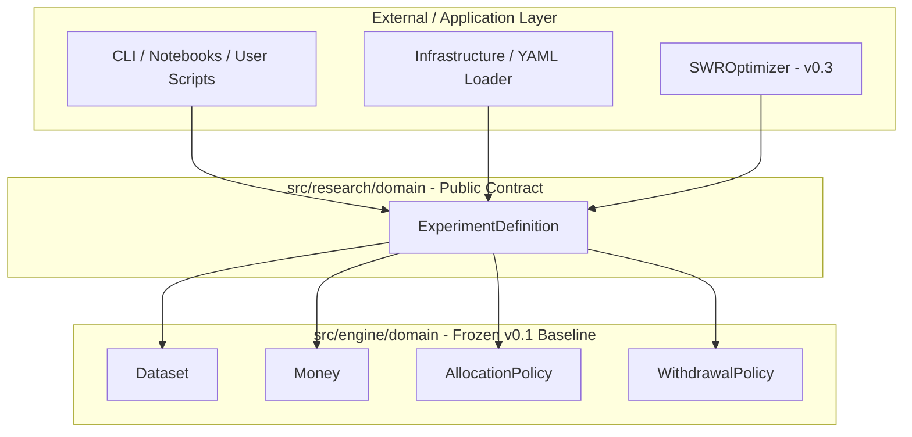

# Architectural Review: `ExperimentDefinition`

## Executive Summary

This document presents the formal architectural review for `ExperimentDefinition`, the foundational declarative schema of the Research Layer (`v0.2-research-layer`).

The review evaluates responsibility boundaries, ownership, dependency directions, relationships with execution engine and research components, immutability guarantees, future extensibility, and the explicit architectural placement of `ExperimentDefinition` as the **Public Research Domain Contract**.

---

## 1. Responsibility Boundaries (Single Responsibility Principle)

`ExperimentDefinition` adheres strictly to the Single Responsibility Principle (SRP).

- **Primary Responsibility:** Represent the declarative specification of a quantitative research study in an immutable, self-contained domain object.
- **Explicit Boundary Limits:**
  - It specifies **what** constitutes a study (dataset reference, horizon, initial wealth, cohort parameters, policy matrices, target criteria).
  - It contains **zero** execution logic, expansion mechanics, or derived simulation counts.
  - It contains **zero** I/O, database persistence, CSV/YAML parsing, or CLI handling.
  - It performs **zero** financial calculations or market updates.

```
┌─────────────────────────────────────────────────────────┐
│                 ExperimentDefinition                    │
│   (Pure Declarative Study Specification Value Object)    │
└────────────────────────────┬────────────────────────────┘
                             │ Reads blueprint
                             ▼
┌─────────────────────────────────────────────────────────┐
│                 ResearchExecutor                        │
│   (Execution Planning, Expansion & Coordination)        │
└────────────────────────────┬────────────────────────────┘
                             │ Invokes (Black Box)
                             ▼
┌─────────────────────────────────────────────────────────┐
│         SimulationRunner (Frozen v0.1 Engine)           │
└─────────────────────────────────────────────────────────┘
```

---

## 2. Ownership & Lifecycle

- **Owner:** The Research Domain (`research.domain`).
- **Creation Context:** Instantiated by research scripts, notebooks, configuration loaders (`infrastructure`), CLI commands, or optimization engines (`v0.3`).
- **Consumers:** CLI, notebooks, infrastructure, optimizers, reporting, reproducibility managers.
- **Execution Engine Status:** The `v0.1` Execution Engine remains **completely unaware** of `ExperimentDefinition`'s existence.

```
Execution Engine (v0.1 Baseline)
       ▲
       │ (Execution Engine does NOT know Research exists)
Research Layer (v0.2 Infrastructure) ──► Public Contract: ExperimentDefinition
       ▲
       │ Consumes Research Layer
Infrastructure / CLI / Notebooks / Optimizers (v0.3)
```

---

## 3. Dependency Direction & Layered Architecture

`ExperimentDefinition` respects Clean Architecture principles and strict layered dependency flow.



### Dependency Invariants
- `ExperimentDefinition` depends **only** on pure engine domain value objects (`Dataset`, `Money`, `AllocationPolicy`, `WithdrawalPolicy`).
- The execution engine has **zero dependencies** on `ExperimentDefinition` or the research layer.
- Domain financial models never depend on research concepts.

---

## 4. Component Relationships

### 4.1 Relationship with `ResearchExecutor`
- `ResearchExecutor` consumes `ExperimentDefinition` as its primary study specification.
- `ResearchExecutor` reads the policies, cohorts, and horizon specified in `ExperimentDefinition` and expands them into concrete simulation tasks.
- **Boundary:** `ExperimentDefinition` is completely passive; it knows nothing about `ResearchExecutor`.

### 4.2 Relationship with `CohortGenerator`
- `CohortGenerator` accepts the `cohorts` specification string/rules and `dataset` referenced in `ExperimentDefinition` to generate validated `Cohort` instances.
- **Boundary:** `ExperimentDefinition` holds declarative cohort parameters; `CohortGenerator` performs temporal windowing and dataset validation.

### 4.3 Relationship with `SimulationContext`
- `SimulationContext` (Execution Engine) is the input contract required for a **single** simulation run.
- `ExperimentDefinition` is a **study-level** specification containing sequences of policies and cohort rules.
- A single `ExperimentDefinition` expands into $N$ distinct `SimulationContext` instances during execution planning.
- **Boundary:** `ExperimentDefinition` does not reference `SimulationContext`.

### 4.4 Relationship with `SimulationRunner`
- `SimulationRunner` executes a single `SimulationContext` within `v0.1 Execution Engine`.
- **Boundary:** `SimulationRunner` is completely decoupled from `ExperimentDefinition`. The `v0.1` frozen execution engine remains 100% untouched.

---

## 5. Immutability & Concurrency Guarantees

1. **Frozen Dataclass:** Declared with `@dataclass(frozen=True)`. Attempting attribute reassignment raises `FrozenInstanceError`.
2. **Defensive Sequence Copying:** Sequence arguments (`cohorts`, `allocation_policies`, `withdrawal_policies`, `targets`) are coerced to immutable `tuple` instances during `__post_init__`. This prevents external callers from mutating underlying lists after instantiation.
3. **Thread & Process Safety:** Because it is completely immutable and hashable, `ExperimentDefinition` can be safely shared across multi-threading or multi-processing workers inside `ResearchExecutor` without locks or side-effects.

---

## 6. Future Extensibility

`ExperimentDefinition` is designed for long-term backward-compatible evolution:

- **Optional Fields:** New research metadata or target criteria can be added as optional fields with default values (`None` or `tuple()`), maintaining full backward compatibility.
- **Policy Polymorphism:** Supports any current or future policy implementing `AllocationPolicy` or `WithdrawalPolicy` domain abstractions without modifying `ExperimentDefinition`.
- **Extensible Target Criteria:** The `targets` tuple accommodates floating-point metrics or custom goal objects without altering core validation.

---

## 7. Architectural Placement & Public Research Domain Contract

### Module Placement

The approved module location is:
```text
src/research/domain/experiment/definition.py
```

Re-exporting it from the top-level research package:
```python
# src/research/__init__.py
from research.domain.experiment.definition import ExperimentDefinition
```

### Architectural Justification

1. **Public Contract of the Research Layer:** `ExperimentDefinition` is exported at `research.ExperimentDefinition` as the primary stable public interface of the Research package.
2. **Layer Isolation:** It is **not** a project-wide global shared model. The execution engine does not know research exists, and core financial models do not depend on research concepts.
3. **Clean Encapsulation:** External consumers (CLI, notebooks, YAML loaders, optimizers) import `ExperimentDefinition` directly from `research`, hiding internal sub-module directory structure.

---

## 8. Architectural Approval Summary

The architecture of `ExperimentDefinition` is **APPROVED**:

- **Placement:** `src/research/domain/experiment/definition.py`, re-exported via `research.ExperimentDefinition`.
- **Role:** Public Research Domain Contract.
- **Responsibilities:** Strictly declarative value object. Zero execution, expansion, or financial logic.
- **Dependencies:** Unidirectional onto engine domain value objects (`Dataset`, `Money`, policies).
- **Immutability:** Guaranteed via frozen dataclass and tuple coercion.
- **Engine Protection:** Zero impact or changes to `v0.1` Execution Engine.

---

## Next Immediate Step

Proceed to **Step 3: Public API Review** (`EXPERIMENT_DEFINITION_PUBLIC_API.md`).
