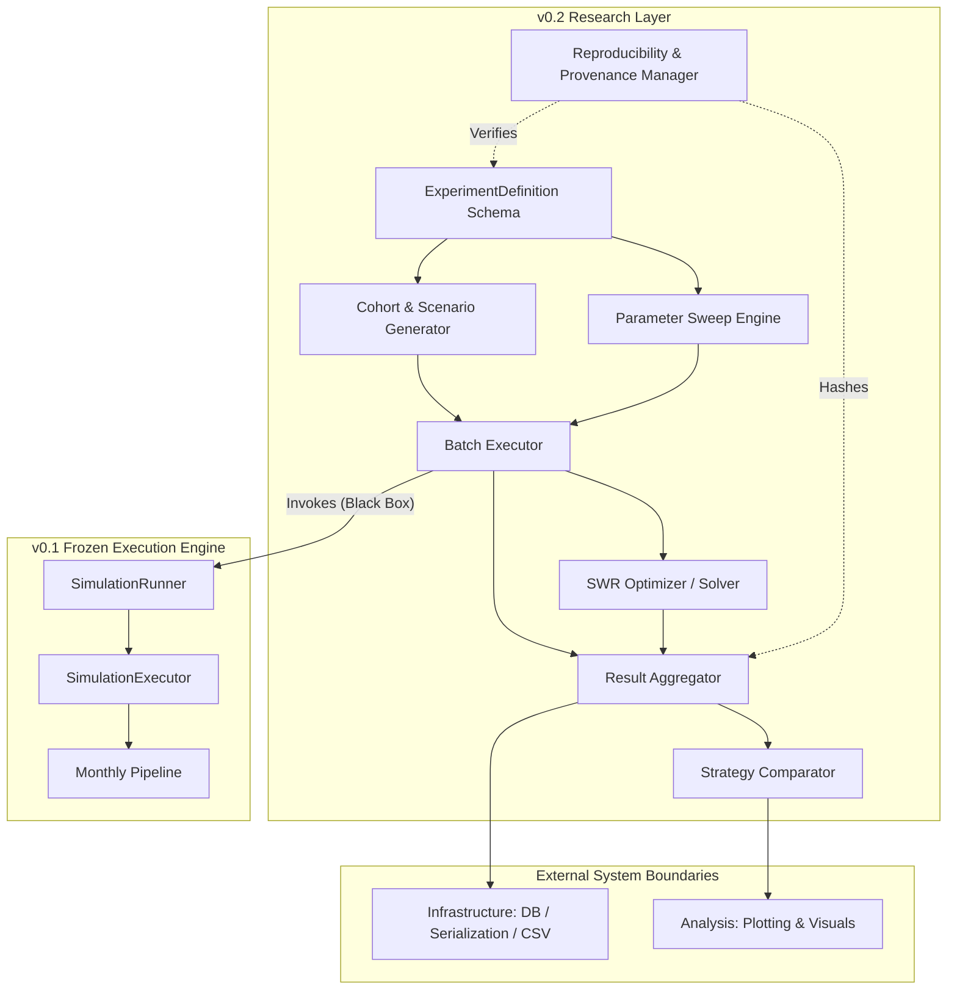
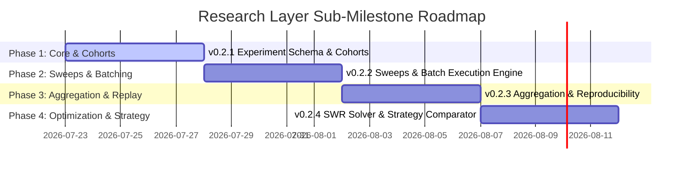

# Research Layer Roadmap (`v0.2-research-layer`)

## Executive Summary

This document establishes the architectural roadmap and component specifications for the **Research Layer** of the Retirement Simulator (`simulador_jubilacion`).

### Baseline Constraints & Guarantees
- **Baseline Tag:** `v0.1-execution-engine` (Permanently Frozen).
- **Execution Engine Status:** Immutable stable infrastructure. The Domain Model, Domain Services, Domain Policies, Monthly Pipeline, Pipeline Steps, `SimulationRunner`, `SimulationExecutor`, and `SimulationStatisticsBuilder` are frozen and will not be modified.
- **Research Layer Purpose:** Maximize research capability to reproduce, validate, and extend quantitative studies published by Early Retirement Now (ERN) in the *Safe Withdrawal Rates (SWR)* series.

---

## 1. Overall Research Architecture

The Research Layer operates strictly on top of the frozen `v0.1` Execution Engine. It treats `SimulationRunner` as a pure, deterministic black box.



### Core Architectural Principles
1. **Engine Independence:** The Research Layer contains zero simulation execution logic. It solely describes, coordinates, sweeps, solves, aggregates, and compares research experiments.
2. **Declarative Experimentation:** Experiments are fully specified via immutable schema (`ExperimentDefinition`), separating *what to run* from *how execution occurs*.
3. **Deterministic Reproducibility:** Every experiment run generates a unique execution fingerprint (hash of dataset, parameters, engine version, and policies) enabling exact bit-for-bit replay.
4. **Decoupled Analytics:** Statistical aggregation and strategy comparison consume raw `SimulationResult` streams without coupling to execution pipeline internals.

---

## 2. Major Components & Responsibilities

### 2.1 Experiment Definition & Schema (`ExperimentDefinition`)
- **Responsibility:** Standardizes the declarative representation of a scientific study.
- **Capabilities:** Defines dataset references, cohort ranges, horizon durations, policy parameter matrices, search spaces, and target metrics.
- **Boundaries:** Pure domain schema. Contains no file IO, execution code, or database drivers.

### 2.2 Scenario & Cohort Generator (`ScenarioGenerator` / `CohortGenerator`)
- **Responsibility:** Generates all evaluation temporal windows (cohorts) across historical financial datasets.
- **Capabilities:** Supports rolling monthly cohorts (e.g. 1871–present), fixed start dates, multi-horizon evaluations (e.g., 30, 40, 50 years), and stress test scenario sub-sampling (e.g., 1929 Great Depression, 1966 Stagflation, 2000 Dot-Com, 2008 GFC).
- **Boundaries:** Consumes `MarketDataset` metadata to emit immutable `Sequence[CohortSpecification]`.

### 2.3 Parameter Sweep Engine (`ParameterSweepEngine`)
- **Responsibility:** Constructs multi-dimensional grid and sweep parameter spaces.
- **Capabilities:** Generates cross-product evaluation matrices for allocation parameters (e.g., equity ratios from 0% to 100% in 5% increments), glidepath parameters (start allocation, end allocation, duration), and withdrawal rates (e.g., 3.0% to 5.0% step 0.10%).
- **Boundaries:** Emits structured collections of parameterized policy configurations without executing them.

### 2.4 Batch Execution Engine (`BatchExecutor`)
- **Responsibility:** Orchestrates high-throughput, isolated batch execution of parameterized simulation matrices over `SimulationRunner`.
- **Capabilities:** Manages task distribution, error isolation (a failed simulation does not abort the batch), memory-efficient streaming of results, and execution progress tracking.
- **Boundaries:** Consumes `SimulationRunner` as an injected dependency. Does not modify or inspect runner internals.

### 2.5 Result Aggregator & Statistical Synthesizer (`ResultAggregator`)
- **Responsibility:** Aggregates individual `SimulationResult` instances across cohorts and parameter grids into statistical research metrics.
- **Capabilities:** Computes success rates, failure probabilities, safe withdrawal rate distributions, terminal wealth quantiles (P1, P5, P10, P25, P50, P75, P90, P99), worst-case drawdowns, and Sequence of Returns Risk (SRR) sensitivity.
- **Boundaries:** Operates purely on completed `SimulationResult` streams.

### 2.6 Safe Withdrawal Rate Solver / Optimizer (`SWROptimizer`)
- **Responsibility:** Numerically solves for exact Safe Withdrawal Rates (SWR) and optimal policy parameters.
- **Capabilities:** Implements binary search root-finding algorithms over target success rates (e.g., 100% success rate or $0 terminal capital constraint across all historical cohorts for a given horizon).
- **Boundaries:** Uses `BatchExecutor` / `SimulationRunner` iteratively as a black-box evaluator.

### 2.7 Strategy Comparison Engine (`StrategyComparator`)
- **Responsibility:** Computes comparative analytics across distinct financial strategies (e.g., Static 60/40 vs. Active Equity Glidepath vs. CAPE-based dynamic withdrawal).
- **Capabilities:** Evaluates relative risk-adjusted metrics, drawdown profiles, survival rate differentials, and trade-off matrices (e.g., additional terminal wealth vs. sequence risk exposure).
- **Boundaries:** Reads aggregated statistics from `ResultAggregator`.

### 2.8 Research Reproducibility & Provenance Manager (`ResearchReproducibilityManager`)
- **Responsibility:** Enforces scientific integrity, provenance tracking, and exact replay.
- **Capabilities:** Generates cryptographic execution hashes covering input datasets, policy specifications, execution engine version tags, and output statistical signatures.
- **Boundaries:** Passive metadata and auditing manager.

---

## 3. Dependencies & Architectural Boundaries

### Research Component Directed Acyclic Graph (DAG)

```
[ExperimentDefinition]
       │
       ├───────────────────────────────┐
       ▼                               ▼
[CohortGenerator]            [ParameterSweepEngine]
       │                               │
       └───────────────┬───────────────┘
                       ▼
               [BatchExecutor] ◄─── (Injected: SimulationRunner [v0.1 Frozen])
                       │
                       ├───────────────────────────────┐
                       ▼                               ▼
               [ResultAggregator]              [SWROptimizer]
                       │                               │
                       ├───────────────────────────────┘
                       ▼
              [StrategyComparator]
                       │
                       ▼
        [ResearchReproducibilityManager]
```

### Boundary Rules
- **Engine Layer:** Completely decoupled. Research components only import public contracts of `engine.domain` and `SimulationRunner`.
- **Infrastructure Layer:** Research components specify serialized schemas; persistence drivers (SQLite/Parquet/YAML) reside strictly in `infrastructure`.
- **Analysis Layer:** Statistical outputs produced by `ResultAggregator` and `StrategyComparator` feed cleanly into visualization engines without embedding plotting code inside `research`.

---

## 4. Implementation Order & Sub-Milestones

To ensure each component builds naturally on the previous one without architectural debt, implementation will strictly follow a 4-phase sub-milestone sequence.



### Sub-Milestone Breakdown

#### Sub-Milestone `v0.2.1`: Experiment Schema & Cohort Generation
1. `ExperimentDefinition` formal schema & validation.
2. `CohortGenerator` & historical cohort windowing (e.g. 1871–present monthly sliding windows).
3. **Mandatory Workflow:** Specification -> Architecture -> API -> Implementation -> Review -> Test -> Approval -> Tag `v0.2.1`.

#### Sub-Milestone `v0.2.2`: Parameter Sweeps & Batch Execution
1. `ParameterSweepEngine` for multi-dimensional grid search spaces.
2. `BatchExecutor` for isolated, parallel, and robust simulation batch runs over `SimulationRunner`.
3. **Mandatory Workflow:** Specification -> Architecture -> API -> Implementation -> Review -> Test -> Approval -> Tag `v0.2.2`.

#### Sub-Milestone `v0.2.3`: Result Aggregation & Reproducibility
1. `ResultAggregator` (Percentiles, SWR distribution, terminal wealth metrics, SRR metrics).
2. `ResearchReproducibilityManager` (Cryptographic run fingerprints & provenance).
3. **Mandatory Workflow:** Specification -> Architecture -> API -> Implementation -> Review -> Test -> Approval -> Tag `v0.2.3`.

#### Sub-Milestone `v0.2.4`: SWR Optimization & Strategy Comparison
1. `SWROptimizer` (Binary search root-finder for max safe withdrawal rates).
2. `StrategyComparator` (Multi-strategy comparative analytics, risk-return trade-offs).
3. **Mandatory Workflow:** Specification -> Architecture -> API -> Implementation -> Review -> Test -> Approval -> Tag `v0.2.4` / `v0.2-research-layer`.

---

## 5. Component Rationale & Justification

| Component | Technical & Quantitative Rationale |
| :--- | :--- |
| **`ExperimentDefinition`** | Eliminates ad-hoc scripting; enforces reproducible declarative research protocols. |
| **`CohortGenerator`** | Essential for testing strategies across 150+ years of diverse macroeconomic cycles (Depression, Stagflation, Bull markets). |
| **`ParameterSweepEngine`** | Enables systematic exploration of non-linear parameter interaction surfaces (e.g., starting vs. ending equity glidepath allocations). |
| **`BatchExecutor`** | Running multi-cohort x multi-parameter studies requires executing 100,000+ simulations efficiently without mutating execution engine state. |
| **`ResultAggregator`** | Transforms massive raw trajectory logs into concise statistical distributions and failure probability quantiles. |
| **`SWROptimizer`** | Safe Withdrawal Rate determination is inherently an optimization problem; binary search root-finding automates exact SWR discovery. |
| **`StrategyComparator`** | Provides rigorous statistical proof of whether active strategies (e.g., active glidepaths) outperform static benchmarks. |
| **`ResearchReproducibilityManager`** | Guarantees academic rigor and scientific integrity, ensuring any published figure can be verified and audited. |

---

## 6. ERN Studies Enabled

This Research Layer architecture specifically enables the full quantitative reproduction and extension of Early Retirement Now's SWR series.

```
┌────────────────────────────────────────────────────────────────────────────────────────┐
│ ERN Study Capabilities Matrix                                                         │
├──────────────────────────────┬────────────────────────────┬────────────────────────────┤
│ ERN Study / Topic            │ Required Research Module   │ Sub-Milestone Enabled      │
├──────────────────────────────┼────────────────────────────┼────────────────────────────┤
│ SWR Part 1: The Basics       │ CohortGenerator            │ v0.2.1                     │
│ (30/40/50 year historical    │ ResultAggregator           │ v0.2.3                     │
│ backtests)                   │ SWROptimizer               │ v0.2.4                     │
├──────────────────────────────┼────────────────────────────┼────────────────────────────┤
│ SWR Part 2: Capital          │ ResultAggregator           │ v0.2.3                     │
│ Preservation vs Consumption │ (Quantiles & Terminal Net) │                            │
├──────────────────────────────┼────────────────────────────┼────────────────────────────┤
│ SWR Part 19: Equity          │ ParameterSweepEngine       │ v0.2.2                     │
│ Glidepaths (Passive &        │ BatchExecutor              │ v0.2.2                     │
│ Active Glidepath sweeps)     │ StrategyComparator         │ v0.2.4                     │
├──────────────────────────────┼────────────────────────────┼────────────────────────────┤
│ SWR Part 20 & 25:            │ ParameterSweepEngine       │ v0.2.2                     │
│ Flexibility & Dynamic        │ SWROptimizer               │ v0.2.4                     │
│ Withdrawals                  │ StrategyComparator         │ v0.2.4                     │
├──────────────────────────────┼────────────────────────────┼────────────────────────────┤
│ SWR Part 28: CAPE-based      │ ParameterSweepEngine       │ v0.2.2                     │
│ Dynamic Allocation &         │ SWROptimizer               │ v0.2.4                     │
│ Withdrawals                  │ StrategyComparator         │ v0.2.4                     │
├──────────────────────────────┼────────────────────────────┼────────────────────────────┤
│ SWR Part 40: De-risking &    │ StrategyComparator         │ v0.2.4                     │
│ Asset Allocation Tradeoffs   │ ResearchReproducibility    │ v0.2.3                     │
└──────────────────────────────┴────────────────────────────┴────────────────────────────┘
```

### Specific Enablement Details for ERN Part 19 (Equity Glidepaths)
- **Parameter Matrix:** Sweeping starting equity % (0%–100%), ending equity % (0%–100%), and glidepath adjustment period (e.g., 60, 120, 180 months). Enabled by `ParameterSweepEngine` (`v0.2.2`).
- **Cohort Backtesting:** Evaluating every 30-year cohort from 1871 to present. Enabled by `CohortGenerator` (`v0.2.1`).
- **SWR Solving:** Finding the maximum withdrawal rate yielding 0% failure for each glidepath trajectory. Enabled by `SWROptimizer` (`v0.2.4`).
- **Benchmark Comparison:** Comparing Glidepath SWRs directly against Static 60/40 and 80/20 portfolios. Enabled by `StrategyComparator` (`v0.2.4`).

---

## 7. Next Immediate Action

Per the mandatory development workflow:
1. **Review:** Wait for approval of `RESEARCH_LAYER_ROADMAP.md`.
2. **Sub-Milestone `v0.2.1` Initiation:** Upon approval, create the **Behavioural Specification** for `v0.2.1: Experiment Schema & Cohort Generation`.
