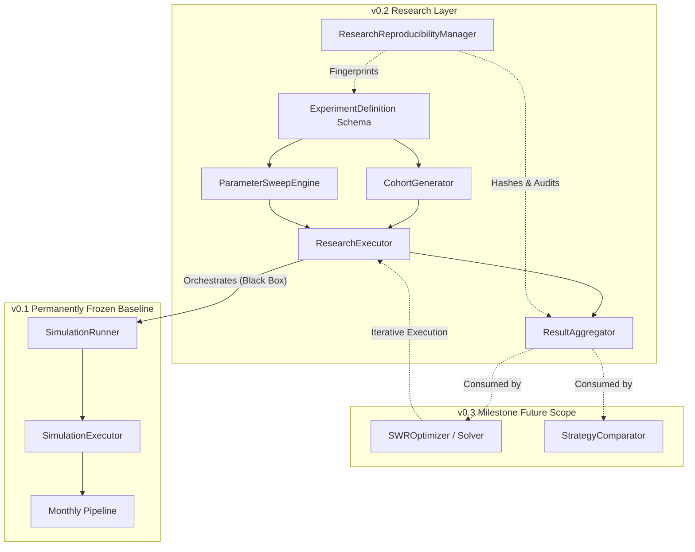
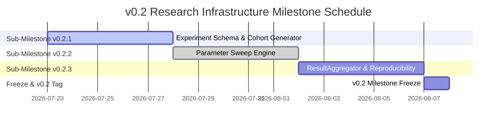

# Research Layer Final Roadmap (`v0.2-research-layer` & `v0.3`)

## Status & Authoritative Declaration

**Status:** APPROVED AND FROZEN  
**Authoritative Document:** `RESEARCH_LAYER_FINAL_ROADMAP.md`  
**Baseline Tag:** `v0.1-execution-engine` (Permanently Frozen Infrastructure)  

This document serves as the **authoritative blueprint** for all research-layer architectural design and implementation. No implementation code will be written prior to formal review of individual sub-milestone behavioral specifications.

---

## 1. Executive Summary & Architectural Refinements

Based on formal architectural review, two key structural adjustments have been incorporated into the research architecture:

1. **Renaming `BatchExecutor` → `ResearchExecutor`**:
   - Avoids generic, implementation-oriented terminology.
   - Clarifies the hierarchy: `SimulationExecutor` runs a single simulation; `ResearchExecutor` orchestrates an entire research study composed of multiple independent simulations.
   - Maintains strict separation of concerns: `ResearchExecutor` coordinates multi-simulation runs, enforces deterministic ordering, and aggregates execution outcomes while owning zero financial logic.

2. **Milestone Scoping (Infrastructure vs. Consumers)**:
   - **`v0.2-research-layer`** focuses exclusively on core **Research Infrastructure** primitives:
     - `ExperimentDefinition`
     - `CohortGenerator`
     - `ParameterSweepEngine`
     - `ResearchExecutor`
     - `ResultAggregator`
     - `ResearchReproducibilityManager`
   - **`v0.3-optimization-and-strategy-analysis`** moves consumer algorithms (`SWROptimizer`, `StrategyComparator`, and future search/optimization algorithms) to a subsequent milestone.
   - Enforces a clean conceptual dependency graph:
     $$\text{Research Infrastructure (v0.2)} \longrightarrow \text{Research Studies} \longrightarrow \text{Optimization \& Analytics (v0.3)}$$

---

## 2. Overall Research Architecture

The Research Layer sits strictly on top of the frozen `v0.1` Execution Engine. The `SimulationRunner` and `SimulationExecutor` are treated as pure, immutable black boxes.



---

## 3. Major Components & Responsibilities

### 3.1 `v0.2` Research Infrastructure Components

#### 1. `ExperimentDefinition` (Schema & Blueprint)
- **Responsibility:** Declarative representation of a scientific research study.
- **Scope:** Specifies dataset references, cohort definitions, horizon lengths, policy parameter spaces, and output target metrics.
- **Invariants:** Pure domain dataclass/schema. Immutable once instantiated. Contains zero IO, database, or execution logic.

#### 2. `CohortGenerator` (Temporal Windowing Engine)
- **Responsibility:** Generates temporal evaluation windows (cohorts) across historical financial datasets.
- **Scope:** Produces rolling monthly cohort start dates (e.g. 1871–present sliding windows), fixed multi-horizon evaluations (e.g., 30, 40, 50 years), and stress test historical sub-samples (e.g., 1929, 1966, 2000, 2008).
- **Invariants:** Consumes `MarketDataset` metadata to emit deterministic `Sequence[CohortSpecification]`.

#### 3. `ParameterSweepEngine` (Search Space Generator)
- **Responsibility:** Generates multi-dimensional parameter grids and search spaces for research studies.
- **Scope:** Emits cartesian products of policy settings (e.g., equity allocation steps 0% to 100%, glidepath start/end ratios and duration, withdrawal rates).
- **Invariants:** Emits structured collections of parameterized policy configurations without executing them.

#### 4. `ResearchExecutor` (Study Orchestrator)
- **Responsibility:** Executes an entire multi-simulation research study deterministically across `SimulationRunner`.
- **Scope:** 
  - Coordinates multi-simulation runs across all cohort/parameter matrix combinations.
  - Enforces strict deterministic execution ordering regardless of execution environment.
  - Handles memory-efficient result streaming and batch error isolation.
- **Invariants:** 
  - `SimulationExecutor` / `SimulationRunner` remains responsible for exactly one simulation.
  - `ResearchExecutor` is responsible for an entire research study.
  - Owns **zero** financial logic.

#### 5. `ResultAggregator` (Statistical Synthesizer)
- **Responsibility:** Aggregates streams of individual `SimulationResult` objects into scientific summary statistics.
- **Scope:** Computes success/failure rates, terminal wealth quantiles (P1, P5, P10, P25, P50, P75, P90, P99), drawdown distributions, and sequence-of-returns risk metrics.
- **Invariants:** Pure post-processing transformation. Does not modify raw simulation outputs.

#### 6. `ResearchReproducibilityManager` (Provenance & Audit Manager)
- **Responsibility:** Ensures cryptographic auditability and exact bit-for-bit study replay.
- **Scope:** Computes hash fingerprints over input dataset versions, experiment schemas, policy configurations, engine version tags, and output statistical signatures.
- **Invariants:** Passive metadata and auditing manager.

---

### 3.2 `v0.3` Consumers & Optimization Components (Future Milestone Scope)

#### 1. `SWROptimizer` (Safe Withdrawal Rate Solver)
- **Responsibility:** Numerically solves for exact Safe Withdrawal Rates and optimal policy parameters.
- **Scope:** Implements root-finding algorithms (e.g., binary search) by iteratively executing research studies via `ResearchExecutor` to find withdrawal rates satisfying target success rate or terminal wealth constraints.

#### 2. `StrategyComparator` (Comparative Analytics Engine)
- **Responsibility:** Performs comparative evaluations between distinct strategies (e.g., Static 60/40 vs. Active Equity Glidepath vs. CAPE-based dynamic withdrawals).
- **Scope:** Evaluates relative risk-adjusted metrics, drawdown profiles, survival rate differentials, and trade-off matrices.

---

## 4. Dependencies & Architectural Boundaries

### Layered Dependency Rules

```
┌─────────────────────────────────────────────────────────┐
│              v0.3 Optimization & Consumers              │
│       [SWROptimizer]           [StrategyComparator]     │
└────────────────────────────┬────────────────────────────┘
                             │
                             ▼
┌─────────────────────────────────────────────────────────┐
│               v0.2 Research Infrastructure              │
│  [ExperimentDefinition] ──► [CohortGenerator]          │
│  [ExperimentDefinition] ──► [ParameterSweepEngine]     │
│  [CohortGenerator] + [ParameterSweepEngine] ──► [ResearchExecutor]
│  [ResearchExecutor] ──► [ResultAggregator]              │
│  [ResearchReproducibilityManager] (Cross-cutting audit) │
└────────────────────────────┬────────────────────────────┘
                             │
                             ▼
┌─────────────────────────────────────────────────────────┐
│          v0.1 Execution Engine (Frozen Baseline)        │
│    [SimulationRunner] ──► [SimulationExecutor]          │
└─────────────────────────────────────────────────────────┘
```

1. **Engine Boundary:** Zero modifications to `v0.1` execution engine code.
2. **Infrastructure Interface:** Data persistence (SQLite, Parquet, YAML) resides in `infrastructure`, separate from domain research schemas.
3. **Analysis Interface:** Visualization, chart generation, and reporting tools belong to `analysis`, consuming outputs from `ResultAggregator`.

---

## 5. Implementation Roadmap & Sub-Milestones

Work will proceed strictly sequentially across three sub-milestones for `v0.2`. Each sub-milestone must complete the mandatory 9-step development workflow before tagging.



### Sub-Milestone `v0.2.1`: Experiment Schema & Cohort Generation
- **Components:** `ExperimentDefinition`, `CohortGenerator`.
- **Deliverables:** Declarative experiment schema, rolling monthly cohort windowing, historical dataset cohort extraction.
- **Tag:** `v0.2.1-cohort-schema`

### Sub-Milestone `v0.2.2`: Parameter Sweep Engine — Complete & Frozen
- **Components:** `ParameterConfiguration`, `ParameterAxis`, `ParameterSweepEngine`.
- **Deliverables:** Immutable primitive parameter configurations, validated named axes, and deterministic multi-dimensional policy-grid generation.
- **Tag:** `v0.2.2-parameter-sweep`
- **Status:** Complete and frozen.

### Next Component: `ResearchExecutor`
- **Status:** Not started.
- **Mandatory first step:** Produce `RESEARCH_EXECUTOR_SPECIFICATION.md` before any architecture, API, or implementation work.

### Sub-Milestone `v0.2.3`: Result Aggregation & Reproducibility
- **Components:** `ResultAggregator`, `ResearchReproducibilityManager`.
- **Deliverables:** Statistical quantile calculations (P1..P99), success/failure metrics, cryptographic run hashing and audit provenance.
- **Tag:** `v0.2.3-aggregation-provenance`

### Milestone Tag: `v0.2-research-layer`
Upon completion of `v0.2.3` and full integration testing, the Research Infrastructure layer will be tagged `v0.2-research-layer` and frozen.

---

## 6. Component Rationale & Justification

| Component | Technical & Quantitative Justification |
| :--- | :--- |
| **`ExperimentDefinition`** | Provides standard declarative research blueprints, preventing fragmented or unrepeatable simulation code. |
| **`CohortGenerator`** | Enables systematic historical backtesting across all rolling 30/40/50 year windows since 1871. |
| **`ParameterSweepEngine`** | Formalizes grid search generation over complex policy spaces (glidepath slopes, allocation steps). |
| **`ResearchExecutor`** | Separates single-simulation execution (`SimulationExecutor`) from multi-simulation study coordination, guaranteeing deterministic ordering. |
| **`ResultAggregator`** | Synthesizes massive trajectory outputs into actionable quantitative research statistics and quantiles. |
| **`ResearchReproducibilityManager`** | Guarantees scientific integrity via cryptographic hashing of inputs, engine version, and outputs. |

---

## 7. ERN Studies Enabled Matrix

The revised `v0.2` Research Infrastructure directly unlocks the execution and empirical analysis of Early Retirement Now (ERN) studies, paving the way for automated optimization in `v0.3`.

```
┌────────────────────────────────────────────────────────────────────────────────────────┐
│ ERN Study Capabilities & Milestone Mapping                                             │
├──────────────────────────────┬────────────────────────────┬────────────────────────────┤
│ ERN Study Topic              │ Research Component Used    │ Milestone                  │
├──────────────────────────────┼────────────────────────────┼────────────────────────────┤
│ SWR Part 1: The Basics       │ CohortGenerator            │ v0.2.1                     │
│ (30/40/50 yr historical      │ ResearchExecutor           │ v0.2.2                     │
│ cohort analysis)             │ ResultAggregator           │ v0.2.3                     │
├──────────────────────────────┼────────────────────────────┼────────────────────────────┤
│ SWR Part 2: Capital          │ ResultAggregator           │ v0.2.3                     │
│ Preservation vs Consumption │ (Quantiles & Net Worth)    │                            │
├──────────────────────────────┼────────────────────────────┼────────────────────────────┤
│ SWR Part 19: Equity          │ ParameterSweepEngine       │ v0.2.2                     │
│ Glidepaths (Passive & Active │ ResearchExecutor           │ v0.2.2                     │
│ Glidepath sweeps)            │ ResultAggregator           │ v0.2.3                     │
├──────────────────────────────┼────────────────────────────┼────────────────────────────┤
│ SWR Part 20 & 25:            │ ParameterSweepEngine       │ v0.2.2                     │
│ Flexibility & Dynamic        │ ResearchExecutor           │ v0.2.2                     │
│ Withdrawals                  │ SWROptimizer               │ v0.3 (Consumer)           │
├──────────────────────────────┼────────────────────────────┼────────────────────────────┤
│ SWR Part 28: CAPE-based      │ ParameterSweepEngine       │ v0.2.2                     │
│ Dynamic Asset Allocation &   │ ResearchExecutor           │ v0.2.2                     │
│ Withdrawal Rules             │ SWROptimizer               │ v0.3 (Consumer)           │
├──────────────────────────────┼────────────────────────────┼────────────────────────────┤
│ SWR Part 40: De-risking &    │ ResultAggregator           │ v0.2.3                     │
│ Allocation Tradeoffs         │ StrategyComparator         │ v0.3 (Consumer)           │
└──────────────────────────────┴────────────────────────────┴────────────────────────────┘
```

---

## 8. Governance & Mandatory Workflow

Every sub-milestone in `v0.2` will strictly adhere to the mandatory 9-step development workflow:

1. **Behavioural Specification**
2. **Architecture Review**
3. **Public API Review**
4. **Implementation**
5. **Code Review**
6. **Validation and Regression Tests**
7. **Approval**
8. **Commit**
9. **Milestone Tag**

---

## 9. Next Immediate Step

With `RESEARCH_LAYER_FINAL_ROADMAP.md` now frozen and authoritative, the next task is to produce the **Behavioural Specification** for `ResearchExecutor`.

---

## 2. Future Documentation Infrastructure (Post-v0.4)

Objective: Implement automated documentation validation to ensure architectural consistency.

*Note: These items are cross-cutting infrastructure work, temporarily tracked in this roadmap until a dedicated Project/Documentation Infrastructure roadmap is justified.*

Tasks:
- [ ] **Documentation Link Validation:** Automated check for broken internal references.
- [ ] **Orphan Document Detection:** Validate all files in `docs/` are reachable from `DOCUMENTATION_TREE.md`.
- [ ] **Canonical Source Validation:** Automated detection of duplicate canonical source references.
- [ ] **Metadata Compliance:** Validate all permanent documents contain the mandatory metadata headers (Purpose, Owner, Responsibility, Update Policy, Status).
- [ ] **Governance Consistency:** Automated checks for conflicting documentation rules.
